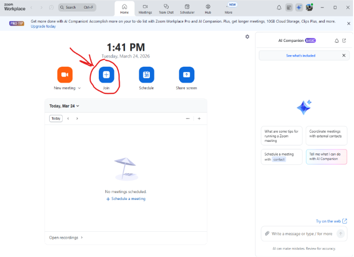
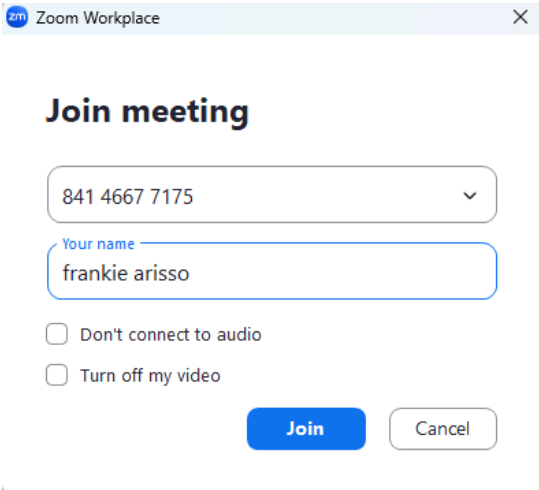
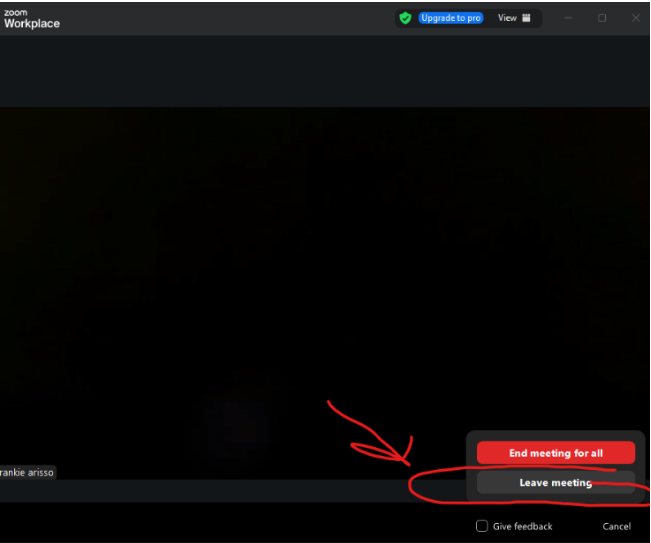

# Instructions

## How to Join a Zoom Meeting on Desktop

1. Launch the Zoom desktop app on your computer.
2. Select **Join a Meeting** on the Zoom home screen.

Figure 1. Zoom home screen with the Join a Meeting button. Screenshot by Francisco Arisso.

3. Enter the meeting ID in the Meeting ID box.
4. Enter your name in the name box.

Figure 2. Meeting box filled out with a Meeting ID and name. Screenshot by Francisco Arisso.

5. Select the **Join** button.
6. Choose **Join with Computer Audio** when Zoom prompts you.
7. Select the **Leave** button in the bottom-right corner when the meeting ends.

Figure 3. Zoom leave meeting button. Screenshot by Francisco Arisso.
